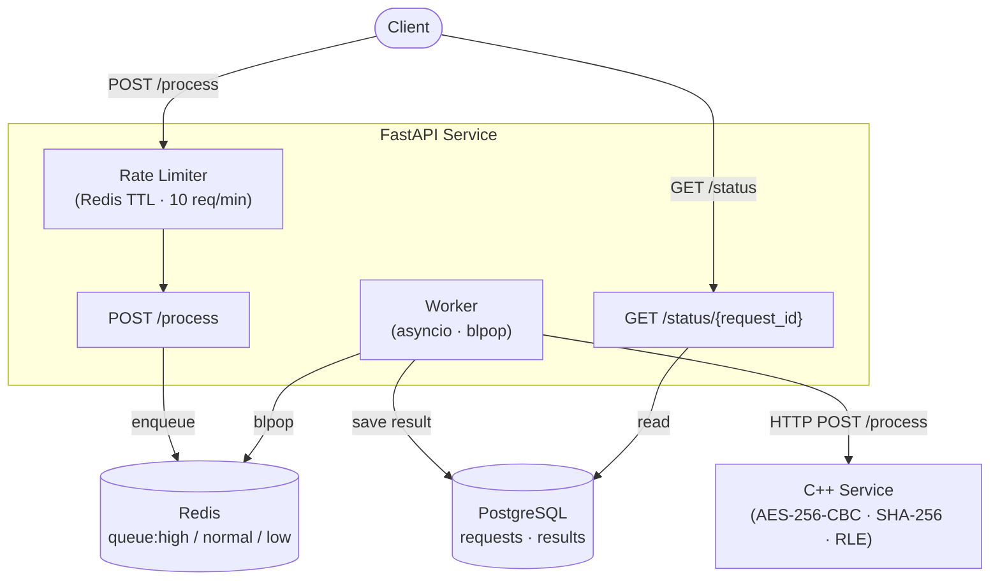

Task Scheduler

An asynchronous task-processing system built with FastAPI, C++ (OpenSSL), Redis and PostgreSQL, fully containerized with Docker Compose.

Clients send tasks (encrypt, hash, compress etc.) through REST API. Queues are prioritized in Redis and handled by a C++ service. Results go to PostgreSQL.


## Architecture



## Features

- Priority queues — tasks routed to `queue:high`, `queue:normal`, or `queue:low` based on request priority (3 / 2 / 1)
- Rate limiting — 10 requests/minute per `x-user-id` header, enforced in middleware via Redis TTL keys
- Async processing — background asyncio worker polls Redis queues (`blpop`) and dispatches to C++ via HTTP
- 5 crypto/compression operations — ENCRYPT, DECRYPT (AES-256-CBC), HASH (SHA-256), TRANSFORM / DECOMPRESS (RLE) — all implemented in C++ with OpenSSL
- Status polling — `GET /status/{request_id}` returns live status (`PENDING → IN_PROGRESS → DONE / FAILED`) with output and processing time
- Fully containerized — single `docker compose up --build` starts the entire stack

Project Structure:-

```
TaskScheduler/
├── app/                   # FastAPI service
│   ├── main.py
│   ├── routes.py
│   ├── worker.py          # Background asyncio task
│   ├── middleware.py      # Rate limiting
│   ├── models.py          # Pydantic v2 schemas
│   ├── database.py        # asyncpg connection pool
│   ├── dependencies.py
│   ├── constants.py
│   ├── logging_config.py
│   └── requirements.txt
├── src/                   # C++ processing service
│   ├── main.cpp
│   ├── processor.h
│   ├── processor.cpp
│   ├── processor_test.cpp # GTest suite
│   ├── CMakeLists.txt
│   └── Dockerfile
├── db/
│   └── schema.sql
├── tests/                 # Python pytest suite
│   ├── test_api.py
│   ├── test_rate_limiter.py
│   └── test_processor.py
├── docker-compose.yaml
├── .env.example
└── pytest.ini
```


Getting Started :-

Pre-requisites 

Docker + Docker Compose Python 3.11+ (optional, local dev), CMake, OpenSSL
Docker Compose Getting Started

    bash cp .env.example .env
    docker compose up -build

All four services start automatically: PostgreSQL -> Redis -> C++ processor -> FastAPI.

FastAPI will be available here http://localhost:8000

API References:-

POST /process
// Request
{
  "user_id": "usr_123",
  "username": "ojasvi",
  "payload": "Hello World",
  "operation": "ENCRYPT",
  "priority": 2
}

// Response 202
{
  "request_id": "550e8400-e29b-41d4-a716-446655440000",
  "status": "PENDING",
  "message": "Task accepted"
}

GET /status/{request_id}
// Response 200
{
  "request_id": "550e8400-e29b-41d4-a716-446655440000",
  "status": "DONE",
  "output_data": "U2FsdGVkX1...",
  "processing_ms": 12,
  "created_at": "2025-06-01T10:00:00Z",
  "processed_at": "2025-06-01T10:00:01Z"
}

Rate limit exceeded — 429
{
  "error": "Rate limit exceeded",
  "message": "You have exceeded the limit of 10 requests per minute",
  "retry_after_seconds": 45
}

Running Tests:-

# Python — 7 tests
pytest tests/ -v

# C++ — 5 tests (encrypt/decrypt round-trip, SHA-256, RLE compress/decompress)
cd src && cmake -B build && cmake --build build && ./build/processor_test

Design Decisions:-

Why C++ service?
The crypto operations (AES-256-CBC, SHA-256) and RLE are CPU bound. Moving it to a separate C++ binary keeps the Python event loop unblocked and allows the processing layer to scale independently.

Why put full JSON in Redis queues?
The worker reads all the details it needs directly from the queue payload, without any extra DB round-trip to get the request details before calling the C++ service.

Why asyncpg and not SQLAlchemy?
A direct async PostgreSQL driver with a connection pool provides a lower overhead for a high-throughput queue-draining worker.


License
MIT
